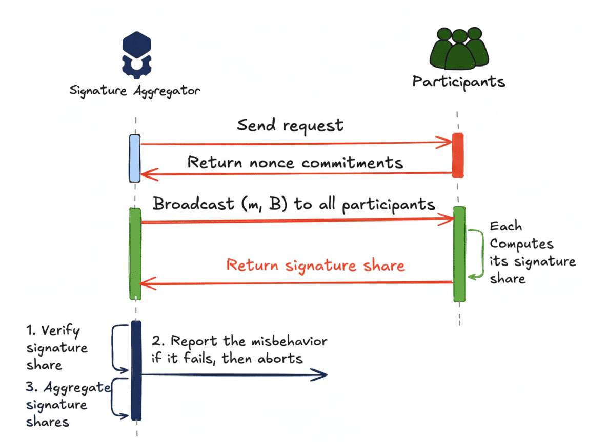
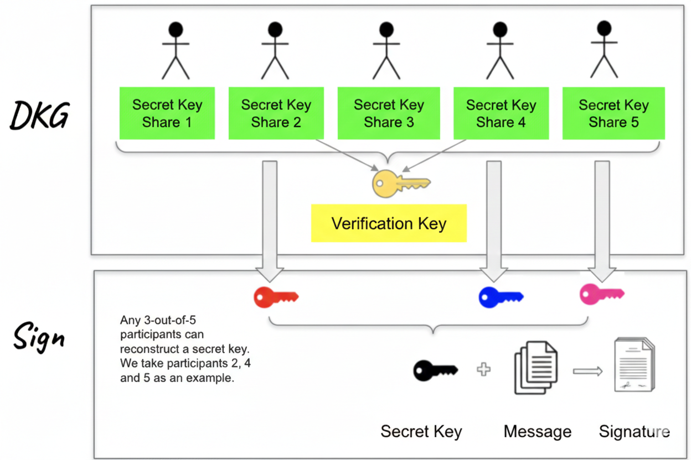

# Keep: FROST threshold signer for Android

Keep is a FROST threshold signing app and dedicated Nostr event signer for Android. It allows users to hold FROST key shares on their phone and sign Nostr events without any single device ever holding the full private key. Keep implements the [NIP-55](https://github.com/nostr-protocol/nips/blob/master/55.md) Android Signer protocol and [NIP-46](https://github.com/nostr-protocol/nips/blob/master/46.md) remote signing, so any compatible Nostr client can request signatures directly.

Like [Amber](https://github.com/greenart7c3/Amber), Keep serves as a dedicated Nostr event signer that keeps private key material segregated from client apps. Both implement NIP-55 and NIP-46 with per-app permissions, background signing, and multiple account support. Keep goes further by splitting keys into FROST threshold shares (2-of-3, 3-of-5, etc.) so that no single device ever holds the complete private key.

<div align="center">

[](https://github.com/privkeyio/keep-android/actions/workflows/ci.yml)
[](/LICENSE)

</div>

# What is FROST?

FROST (Flexible Round-Optimized Schnorr Threshold Signatures) is a cryptographic protocol that lets a group securely share control of a single private key without anyone ever seeing or reconstructing the full key.

Participants start with distributed key generation (DKG): n people each create a share, ending up with one shared public key (just like a normal Schnorr key in Bitcoin or Nostr).

To sign a message, only a threshold (e.g., 3-out-of-5) collaborate. They exchange messages in just two rounds (hence "round-optimized"), then combine partial signatures into one valid Schnorr signature that looks identical to a single-person signature—no one can tell it was threshold-based.

This approach is more efficient and private than traditional multisig (which bloats data and exposes multiple keys) or basic secret sharing (which often requires a trusted dealer or risky full-key reconstruction).

Here's how the basic flow works visually:






FROST is especially useful for Nostr because Nostr uses Schnorr keys for signing events (posts, zaps, etc.). Projects like Keep leverage FROST to enable shared or multisig Nostr accounts—letting friends or teams jointly control one profile without any single person holding the full key, perfect for group accounts or more resilient personal setups.

# Features

- FROST threshold signing (2-of-3, 3-of-5, etc.)
- NIP-55 Android Signer protocol (intents + content provider)
- NIP-46 remote signing (bunker service)
- Import and export FROST shares via QR code or text
- Import existing nsec keys
- Multiple account support
- Per-app signing permissions and policies
- Signing history and audit log
- Biometric and PIN authentication
- Hardware-backed key storage (Android Keystore)
- Kill switch for emergency key deletion
- SOCKS proxy support (Tor)
- NIP-44 encryption and decryption
- Background signing with configurable rate limits
- Certificate pinning for relay connections

# Download

[](https://github.com/privkeyio/keep-android/releases)

# Usage

Any Nostr client that supports NIP-55 or NIP-46 can use Keep for signing.

Supported NIP-55 operations: `get_public_key`, `sign_event`, `nip04_encrypt`, `nip04_decrypt`, `nip44_encrypt`, `nip44_decrypt`, `decrypt_zap_event`.

# Building

```bash
./gradlew assembleDebug
```

APK output: `app/build/outputs/apk/debug/app-debug.apk`

# Development

To rebuild the native libraries from source:

```bash
# Requirements: Rust 1.85+, Android NDK r29, cargo-ndk

# Clone keep workspace
git clone https://github.com/privkeyio/keep ../keep

# Rebuild native libs and bindings
KEEP_REPO=../keep ./build-rust.sh
```

# Contributing

[GitHub issues](https://github.com/privkeyio/keep-android/issues) and [pull requests](https://github.com/privkeyio/keep-android/pulls) are welcome.

By contributing to this repository, you agree to license your work under the AGPL-3.0 license. Any work contributed where you are not the original author must contain its license header with the original author(s) and source.

# License

AGPL-3.0-or-later
